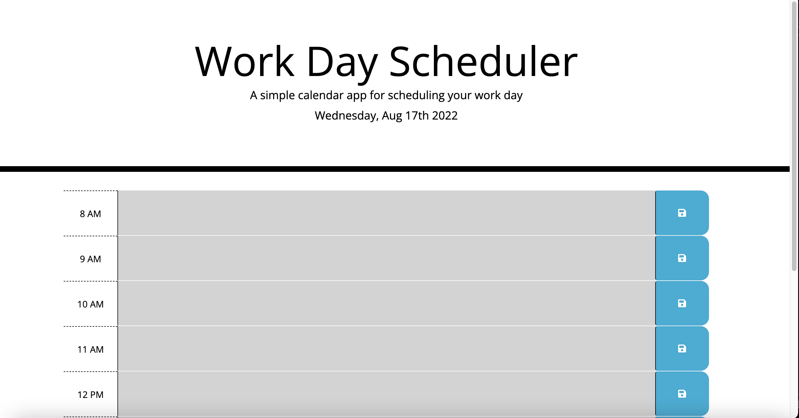

#### Schedule-of-the-Day
### By _**{Miles Fonua}**_

CONTENTS OF THIS FILE
---------------------

 * Introduction
 * Deployment
 * Technology Used
 * Installation
 * Known Bugs/ Creator Content

  ### Introduction

  Do you ever feel like you wish you had a Daily planner to keep the schedule of you day? The Schedule of the day allows a user to input their schedule of events for each hour of the day.  

   ### Deployment

   https://mffonua.github.io/Schedule-of-the-Day/

   ## Technologies Used

* _My apple-mac laptop_
Website Resources
* W3 Schools
* Lots of Google
* Lots of Youtube

## Installation
* To install the user must have access to the Internet; Once connected to the internet the user must enter in the url https://mffonua.github.io/Schedule-of-the-Day/  After clicking enter the user is then led to the Work Day Scheduler and is able to use the daily log.

 ## Known Bugs
 *So Far None. 